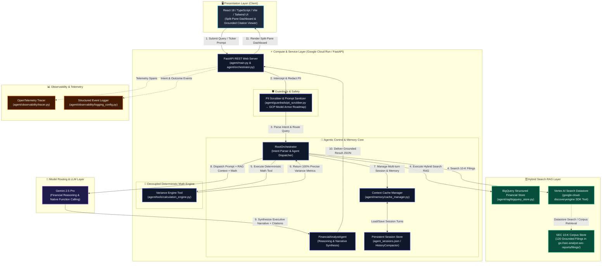
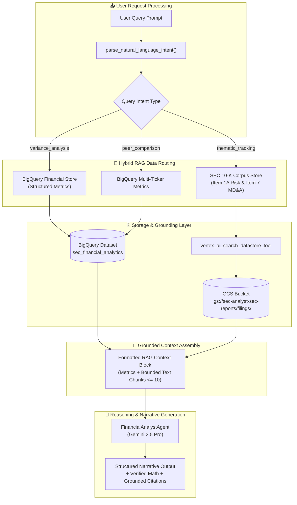

# SEC EDGAR Natural Language Analyst - System Architecture

This document provides the complete, authoritative architectural specification for the **SEC EDGAR Natural Language Analyst**, detailing component interactions, grounded RAG retrieval pathways, model routing strategy, and execution sequences.

---

## 1. High-Level System Architecture Flowchart

---

## 2. Step-by-Step Execution Sequence Diagram

```mermaid
sequenceDiagram
    autonumber
    actor Analyst as Financial Analyst
    participant UI as React 18 UI (Client)
    participant API as FastAPI Server (Cloud Run)
    participant PII as PII Scrubber Guardrail
    participant Orchestrator as RootOrchestrator
    participant RAG as Hybrid Search Engine (BQ + SEC 10-K)
    participant Math as Deterministic Math Engine
    participant LLM as Gemini 2.5 Pro Model

    Analyst->>UI: Submit Financial Prompt (e.g., "Analyze Meta risk factors disclosure")
    UI->>API: POST /api/v1/analyze (User Query)
    
    rect rgb(15, 23, 42)
        Note over API, PII: Phase 1: Security & Guardrail Interception
        API->>PII: Sanitize Prompt (Redact SSNs, Emails, API Keys)
        PII-->>API: Clean Prompt
    end

    rect rgb(30, 27, 75)
        Note over API, Orchestrator: Phase 2: Intent Parsing & Routing
        API->>Orchestrator: dispatch_query(user_prompt)
        Orchestrator->>Orchestrator: parse_natural_language_intent() → QueryType, Tickers, Years, Keywords
    end

    rect rgb(6, 78, 59)
        Note over Orchestrator, RAG: Phase 3: Grounded RAG & Tool Execution
        Orchestrator->>RAG: execute_hybrid_search(HybridSearchRequest)
        RAG->>RAG: Fetch BigQuery Golden Metrics & SEC 10-K Chunks
        RAG-->>Orchestrator: Grounded RAG Result (Bounded Chunks <= 10)
        
        opt Quantitative Variance Query
            Orchestrator->>Math: calculate_financial_variance_tool(ticker, metric, current, prior)
            Math-->>Orchestrator: Exact Variance Result (100% Precision)
        end
    end

    rect rgb(69, 26, 3)
        Note over Orchestrator, LLM: Phase 4: Gemini 2.5 Pro Narrative Synthesis
        Orchestrator->>LLM: generate_content(System Instructions + Grounded Context + Tools)
        LLM-->>Orchestrator: Synthesized Narrative + Citations + KPI Metrics
    end

    Orchestrator-->>API: Return Unified Dispatch Result JSON
    API-->>UI: Return HTTP 200 (Narrative, KPI Cards, Grounded SEC Citations)
    UI->>Analyst: Render Executive Report & Grounded 10-K Source Viewer
```

---

## 3. Subagent & Data Retrieval Pipeline

---

## 4. Key Architectural Component Descriptions

### 1. ADK Root Orchestrator (`agent/orchestrator.py`)
- **Intent Parsing**: Extracts target ticker symbols (`AAPL`, `MSFT`, `NVDA`, `GOOGL`, `AMZN`, `TSLA`, `META`, `AMD`, `JPM`, `WMT`), fiscal years, metric names, and thematic keywords.
- **Routing & Dispatch**: Directs incoming queries through the hybrid RAG engine and invokes `FinancialAnalystAgent`.

### 2. Financial Analyst Agent (`agent/orchestrator.py`)
- **Reasoning Model**: Utilizes **Gemini 2.5 Pro** exclusively for high-precision financial synthesis, multi-turn reasoning, and narrative generation.
- **Native Tool Calling**: Equipped with native function definitions (`calculate_financial_variance_tool`, `query_bigquery_financial_metrics_tool`, `search_sec_filing_chunks_tool`, `vertex_ai_search_datastore_tool`).

### 3. Decoupled Deterministic Calculation Engine (`agent/tools/calculation_engine.py`)
- Computes period-over-period financial variance (absolute change & percentage change) using Python floating-point precision.
- Eliminates LLM arithmetic hallucination by enforcing 100% deterministic calculation accuracy.

### 4. Hybrid Search RAG Layer (`agent/rag/`)
- **Structured Store (`agent/rag/bigquery_store.py`)**: Queries BigQuery for golden financial metrics (Revenue, Operating Income, Net Income).
- **Unstructured Store (`agent/rag/sec_corpus.py`)**: Searches 120 unabridged SEC 10-K filing disclosures grounded in Google Cloud Storage (`gs://sec-analyst-sec-reports/filings/`).
- **Token Window Bounding**: Enforces chunk capping (`<= 10` chunks) per query to ensure context size stays within optimal model window parameters.

### 5. Guardrails & Observability (`agent/guardrails/` & `agent/observability/`)
- **PII Scrubber**: Sanitizes sensitive user tokens (SSNs, emails, credit cards, API keys) prior to processing. (Roadmap: Transitioning to GCP Model Armor).
- **Telemetry & Traceability**: OpenTelemetry span instrumentation (`tracer.py`) and structured JSON intent/outcome event logging (`logging_config.py`).
