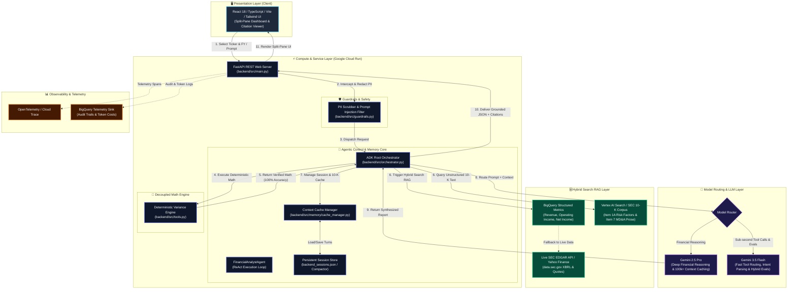

# SEC EDGAR Natural Language Analyst - System Architecture

This document provides a Markdown-friendly architectural specification for the **SEC EDGAR Natural Language Analyst**, illustrating component interactions, data grounding pathways, and step-by-step execution sequences.

---

## 1. High-Level System Architecture Flowchart

---

## 2. Step-by-Step Execution Sequence Diagram

```mermaid
sequenceDiagram
    autonumber
    actor Analyst as Financial Analyst
    participant UI as React 18 UI (Client)
    participant API as FastAPI Backend (Cloud Run)
    participant Math as Deterministic Math Engine
    participant RAG as Hybrid Search RAG (BigQuery + SEC Corpus)
    participant Cache as Context Cache Manager
    participant LLM as Gemini 2.5 Pro / 3.5 Flash
    participant OTEL as OpenTelemetry / Cloud Trace

    Analyst->>UI: Submit Variance Query (e.g. AAPL Revenue FY2023 vs FY2022)
    UI->>API: POST /api/v1/analyze (JSON payload)
    
    rect rgb(15, 23, 42)
        Note over API, Math: Phase 1: Decoupled Deterministic Calculation
        API->>Math: Execute calculate_financial_variance(current, prior)
        Math-->>API: Return Variance (Absolute: -$11,043M, Pct: -2.8%, Direction: Decrease)
    end

    rect rgb(30, 27, 75)
        Note over API, RAG: Phase 2: Hybrid RAG Data Retrieval
        API->>RAG: Query BigQuery metrics & Vertex AI Search 10-K text chunks
        RAG-->>API: Return Grounded MD&A excerpts & structured golden facts
    end

    rect rgb(69, 26, 3)
        Note over API, Cache: Phase 3: Context Caching & Model Reasoning
        API->>Cache: Verify / Load 100k+ Token SEC Filing Cache
        API->>LLM: Dispatch Prompt + Verified Math + Grounded 10-K Chunks
        LLM-->>API: Generate Agentic Executive Synthesis Report + Inline Citations
    end

    rect rgb(6, 78, 59)
        Note over API, OTEL: Phase 4: Observability & Grounded Response
        API->>OTEL: Export End-to-End Traces & Log Token Consumption to BigQuery
        API-->>UI: Return HTTP 200 (Narrative, KPI Cards, Grounded Citations)
    end

    UI->>Analyst: Render Executive Report & Split-Pane 10-K Source Viewer
```

---

## 3. Key Architectural Component Descriptions

1. **Decoupled Deterministic Calculation Engine (`backend/src/tools.py`)**:
   - Computes period-over-period financial variance (absolute change & percentage change) using Python floating point math.
   - Guarantees 100% numerical accuracy and prevents LLM arithmetic hallucination.

2. **Hybrid Search RAG Layer (`backend/src/rag/`)**:
   - Unifies structured BigQuery golden metrics with unstructured SEC 10-K text chunks (MD&A & Risk Factors).
   - Falls back dynamically to live SEC EDGAR XBRL APIs (`data.sec.gov`) for any unknown or newly queried tickers.

3. **Strategic Model Router (`backend/src/orchestrator.py`)**:
   - **Gemini 2.5 Pro**: Handles deep financial reasoning, narrative synthesis, and 100k+ token filing context caching.
   - **Gemini 3.5 Flash**: Handles fast intent parsing, tool routing, sub-second queries, and automated evaluation passes.

4. **Split-Pane Web UI Dashboard (`agent/static/` / `frontend/src/`)**:
   - Interactive KPI cards, executive synthesis narrative, inline grounded citations, and a grounded 10-K source chunk viewer.
   - Features a Human-In-The-Loop (HITL) approval guardrail modal for external GCS exports.
